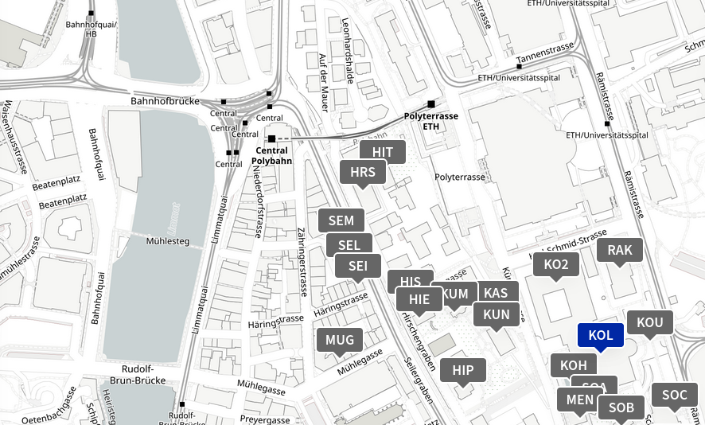

# Re-use of editions and text collections: The role of APIs

## About

**Re-use of editions and text collections: The role of APIs**

*Workshop by the swissuniversities ORD [ReSED project](https://search.usi.ch/projects/4476/re-use-standards-for-editions-data-with-application-programming-interfaces)*

The workshop provides scholarly editors and other interested participants with a hands-on opportunity to learn how to use APIs on Day 1. On Day 2, participants will discuss real and potential cases of re-use of data from editions and text collections. After the workshop, the organisers will draft guidelines to support editors decide how to expose data in order to maximize its potential for reuse across different disciplines.

**Dates:** Jan 29 and Jan 30, 2026  

**Location:** University of Zurich, KOL H-317

**Format:** On-site only / in person

### Organisers

- Elena Chestnova, elena.chestnova@usi.ch
- Peter Daengeli, peter.daengeli@unibe.ch
- Elena Spadini, elena.spadini@unibe.ch
- Yann Stricker, yann.stricker@uzh.ch

### Funding

 

 
 

## Program

### January 29, 2026: APIs for editions and text collections

|||
|---|---|
|10:00-11:00| Welcome & Intro to APIs |
|11:00-11:30| Coffee break |
|11:30-12:30| How to design an API |
|12:30-13:30| Lunch |
|13:30-15:00| APIs presentations* |
|15:00-15:30| Coffee break |
|15:30-17:00| APIs presentations* |

\* APIs presentations by Ingo Börner, Elena Chestnova, Neil Jefferies, Matteo Romanello, Peter Stadler, Andreas Wagner. Chairs: Marilena Daquino, Katharina Brückmann.

--- 

### January 30, 2026: Re-use of editions and text collections

|||
|---|---|
|09:00-9:20| Report on stakeholder interviews |
|09:20-10:40| Data re-use case studies |
|           | Anne-Sophie Bories and Petr Plecháč |
|           | Martin Grandjean |
|           | Ina Serif |
|10:40-11:10| Coffee break |
|11:10-12:30| Data re-use case studies |
|           | Jessica Rebecca Meierhofer and Jonathan Schaber "Digital Editions of Medieval Gallo-Romance Documents for Linguistic Research" |
|           | Christa Schneider "Re-using Edition Data for Historical Sociolinguistics: Practical Workflows and Methodological Needs" |
|           | Michael Schonhardt |
|12:30-13:30| Lunch |
|13:30-15:00| Group activity: re-use scenarios |
|15:00-15:30| Coffee break |
|15:30-16:15| Group reports |
|16:15-16:30| Conclusions |

--- 

## Register

The event is open to everyone and free of charge, but registration is mandatory.

<a href="https://forms.office.com/e/qrxM9dWwHE" target="_blank" class="btn-primary btn-large">Please register here.</a>

## Venue

**KOL H 317, University of Zurich**

Rämistrasse 71

8006 Zürich

[https://www.uniability.uzh.ch/static/current/buildings/KOL/rooms/H-317](https://www.uniability.uzh.ch/static/current/buildings/KOL/rooms/H-317)

Check on campus map: [https://www.plaene.uzh.ch/KOL](https://www.plaene.uzh.ch/KOL)

## Hotels

### Recommended Hotels

- Hotel Plattenhof (Design & Boutique Hotel Plattenhof in Zurich - boutique Hotel tucked away in the quiet university neighborhood)
- St. Josef (3-star superior boutique hotel St. Josef is a quiet, cozy boutique city hotel right in the center of Zurich)

Please note that we do not have arrangements with these or other hotels.

If you are a speaker and have questions regarding accommodation, please contact the [organisers](/#/about#organisers).

